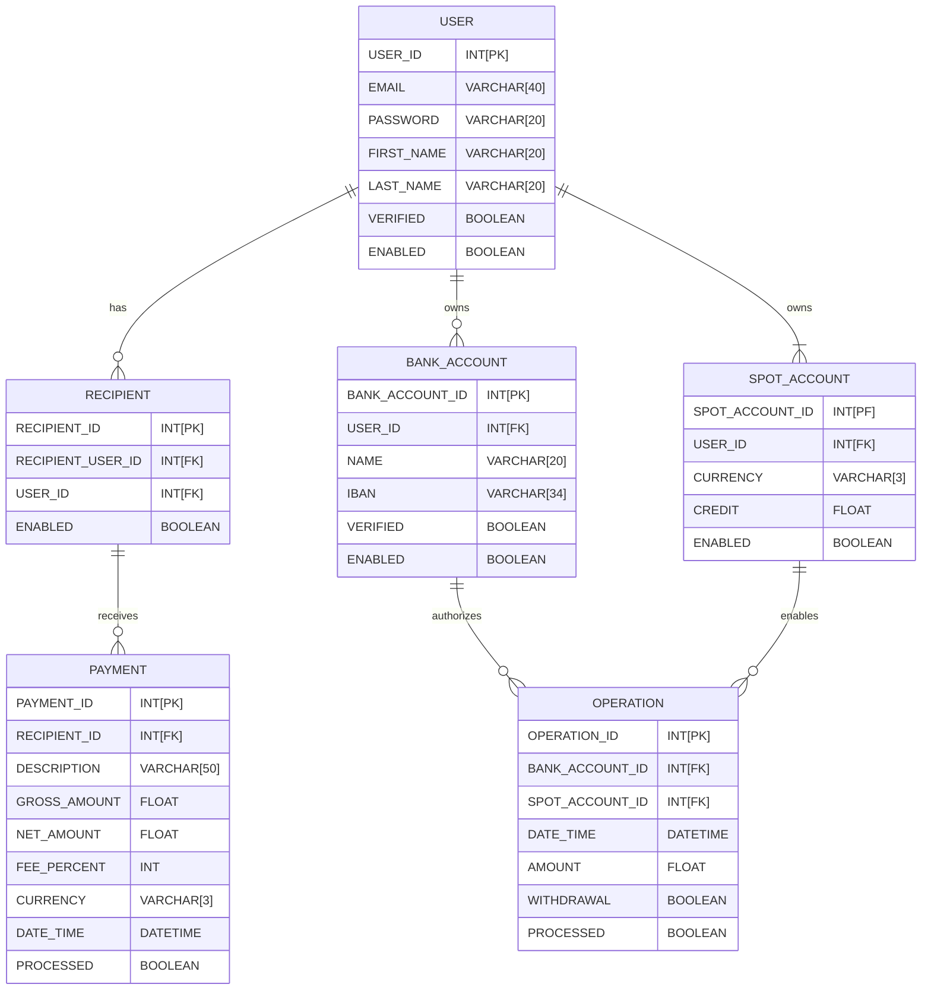

Conceptual Data Model

```mermaid
erDiagram
    USER ||--o{ FRIEND : has;
    USER ||--|{ SPOT_ACCOUNT : has;
    USER ||--o{ TRANSACTION : perform;
    FRIEND ||--o{ TRANSACTION : perform;
    USER ||--o{ BANK_ACCOUNT : owns;

    USER {
        int id
        string email
        boolean verified
        string firstName
        string lastName
}
SPOT_ACCOUNT {
    int id
    string currency
    double credit
}
FRIEND  {
    int id
    int friendOwner
    int friendTarget
}

BANK_ACCOUNT    {
    int id
    string name
    string iban
    boolean verified
}

TRANSACTION {
    int id
    id sender
    id receiver
    double rawAmount
    double netAmount
    double fee
    datetime dateTime
    boolean processed
}
```

Relational Data Model


